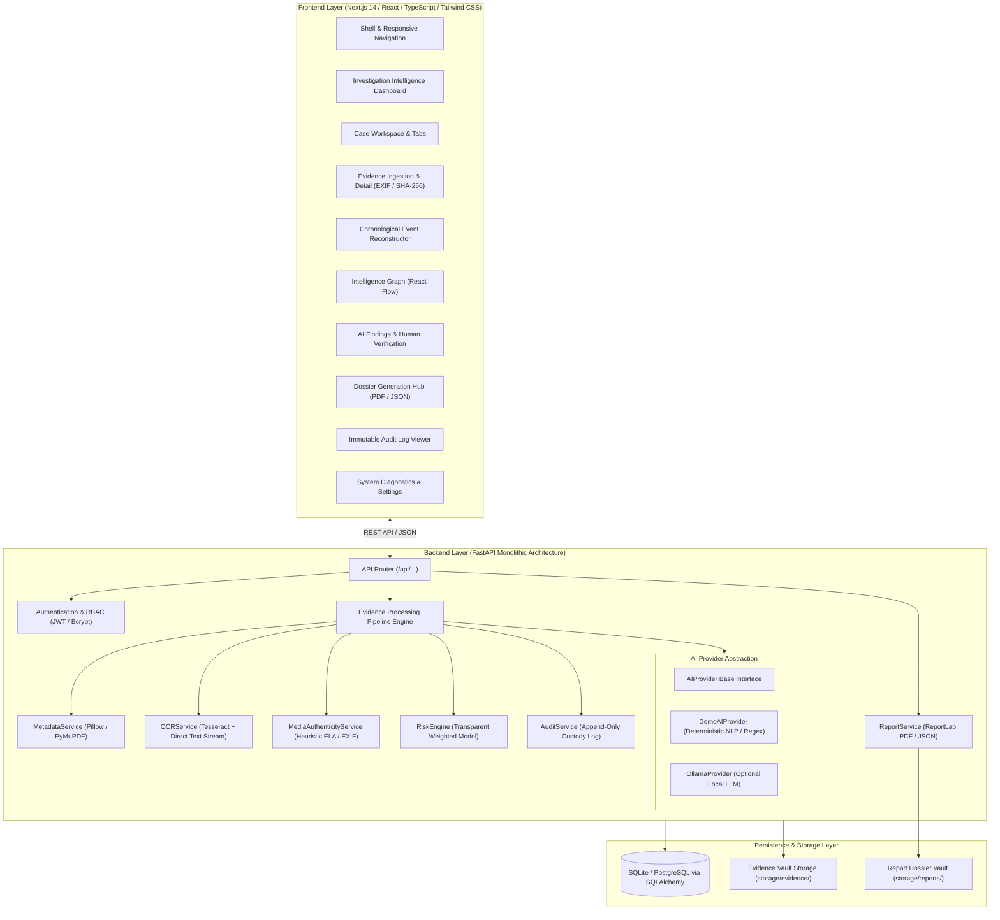

# Sentinel Fusion Architecture Specification

## 1. System Overview
Sentinel Fusion is an AI-assisted Digital Forensics and Intelligence Fusion Platform designed to transform fragmented digital evidence into connected, explainable, and auditable investigative intelligence.

The platform operates under the core design tenet: **AI is an Assistant, Not an Autonomous Investigator.** All analytical deductions (Named Entity Recognition, communication clustering, risk assessment, and manipulation heuristics) are surfaced as decision-support hypotheses that require explicit human investigator corroboration.

---

## 2. High-Level Architecture Diagram



---

## 3. Evidence Processing Pipeline
When evidence files are ingested through the UI or API, the system advances the item sequentially across five strict backend states:

```
[UPLOADED]
   │
   ▼
[HASHING] ──────────► Compute raw SHA-256 byte digest and verify against existing records
   │
   ▼
[METADATA] ─────────► Extract EXIF tags, GPS coords, camera sensor, PDF headers, and run MediaAuthenticityService
   │
   ▼
[TEXT/OCR] ─────────► Direct stream text parser (or Tesseract OCR if binary is available)
   │
   ▼
[ENTITY EXTRACTION] ─► AIProvider extracts Persons, Devices, Accounts, Locations, and Organizations
   │
   ▼
[AI ANALYSIS] ──────► Generate structured findings with confidence metrics and correlation anchors
   │
   ▼
[COMPLETE] ─────────► Recalculate investigation risk index and log audit custody event
```

---

## 4. AI Provider Abstraction
To ensure full zero-cost functionality without paid third-party AI APIs (OpenAI, Claude, Gemini), the system implements an extensible provider interface:
- **`DemoAIProvider` (Default):** Deterministic, understandable processing using compiled regular expressions, keyword frequency distributions, and transparent heuristic confidence calculations. Outputs are tagged with `analysis_mode="DEMO_ANALYSIS"`.
- **`OllamaProvider` (Optional Local LLM):** Connects to `http://localhost:11434`. If Ollama is unavailable or times out, it automatically and silently falls back to `DemoAIProvider` without crashing.

---

## 5. Chain of Custody & Audit Architecture
All critical investigator actions (`LOGIN`, `EVIDENCE_UPLOAD`, `EVIDENCE_PROCESS`, `EVIDENCE_VIEW`, `FINDING_REVIEW`, `REPORT_GENERATE`, `CASE_CREATE`) are recorded in an append-only `audit_logs` table. There are no UI deletion mechanisms for audit logs, preserving evidentiary fidelity.
